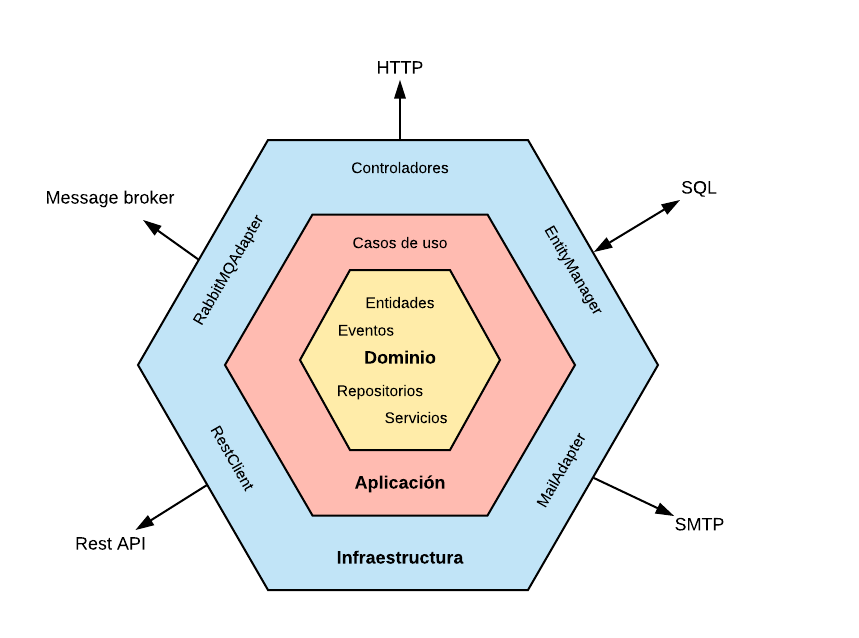
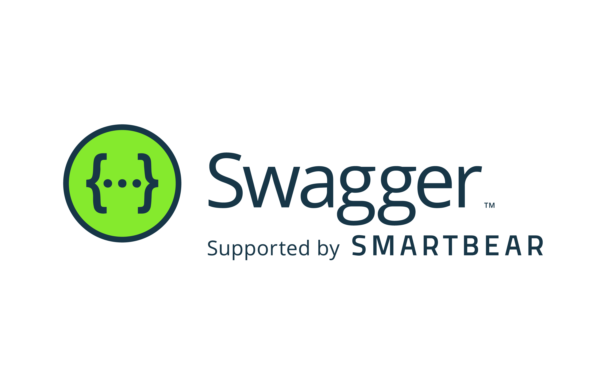

# Microservicio de Consulta de Productos

Este microservicio proporciona una API REST para consultar información detallada de productos a partir de su código EAN (European Article Number).

## Aclaración inicial

Se toma la decisión de subir el fichero .env al repositorio para facilitar la configuración y corrección del mismo, pese a ser una pésima práctica y una vulnerabilidad dse seguridad. Igualmente, se opta por usar git merge para que sea más fácil seguir el flujo de trabajo realizado, aunque personalmente prefiero fetch + rebase, que crea un historial más limpio.

## Funcionalidades

El microservicio proporciona las siguientes funcionalidades:

- Consulta de productos por código EAN.
- Creación de usuarios.
- Autenticación de usuarios.
- Gestión de la caché de productos.
- Gestión de la base de datos de productos.
- Documentación de la API REST con Swagger.
- Autenticación y seguridad con JWT.
- Pruebas de los endpoints con Postman.
- Dockerización del microservicio.

## Tecnologías Utilizadas


Este proyecto está desarrollado utilizando las siguientes tecnologías:

- Java 17: El lenguaje de programación principal utilizado para el desarrollo del microservicio.
- Spring Boot 3.2.5: Framework de desarrollo de aplicaciones Java basado en Spring que facilita la creación de microservicios.
- Git: Sistema de control de versiones distribuido utilizado para el control del código fuente y la colaboración en el desarrollo del proyecto.
- H2 Database: Base de datos en memoria utilizada para persistir la información del sistema.
- JWT (JSON Web Tokens): Mecanismo utilizado para la autenticación y seguridad del servicio REST.
- Caffeine: Biblioteca de caché utilizada para implementar una caché in-memory en el servicio.
- FlyWay: Herramienta utilizada para gestionar y aplicar cambios en la estructura de la base de datos de forma controlada.
- Postman: Herramienta utilizada para probar y documentar los endpoints de la API REST.

## Arquitectura Hexagonal

El proyecto sigue una arquitectura hexagonal (también conocida como puertos y adaptadores) para separar las preocupaciones y facilitar el mantenimiento y la escalabilidad.

La arquitectura hexagonal se basa en tres componentes principales:
- **Dominio:** Contiene la lógica de negocio y las reglas del dominio.
- **Aplicación:** Contiene los casos de uso de la aplicación y orquesta las operaciones del dominio.
- **Infraestructura:** Contiene los detalles de implementación como bases de datos, servicios externos, y frameworks.

La siguiente imagen ilustra la estructura de la arquitectura hexagonal:



## Instalación

### Requisitos previos

Para ejecutar este proyecto, necesitarás tener instalado Java 17 y Maven en tu sistema. Aquí te mostramos cómo instalarlos en diferentes sistemas operativos.

#### Windows

Para instalar Java 17 en Windows, puedes seguir estos pasos:

1. Descarga el instalador de Java 17 desde la [página oficial de Oracle](https://www.oracle.com/java/technologies/javase-jdk17-downloads.html).
2. Ejecuta el instalador y sigue las instrucciones en pantalla.

Para instalar Maven en Windows, puedes seguir estos pasos:

1. Descarga el archivo binario de Maven desde la [página oficial de Apache Maven](https://maven.apache.org/download.cgi).
2. Descomprime el archivo en el directorio que desees.
3. Añade la variable de entorno `M2_HOME` que apunte al directorio donde descomprimiste Maven.
4. Añade `%M2_HOME%\bin` al `PATH`.

#### Linux

Para instalar Java 17 en Linux, puedes usar el gestor de paquetes de tu distribución. Por ejemplo, en Ubuntu puedes usar `apt`:

```bash
sudo apt update
sudo apt install openjdk-17-jdk
```

Para instalar Maven en Linux, puedes seguir estos pasos:

1. Descarga el archivo binario de Maven desde la [página oficial de Apache Maven](https://maven.apache.org/download.cgi).
2. Descomprime el archivo en el directorio que desees.
3. Añade la variable de entorno `M2_HOME` que apunte al directorio donde descomprimiste Maven en tu archivo `.bashrc` o `.bash_profile`.
4. Añade `$M2_HOME/bin` al `PATH` en tu archivo `.bashrc` o `.bash_profile`.

#### macOS

Para instalar Java 17 y Maven en macOS, puedes usar `brew`:

```bash
brew install openjdk@17
brew install maven
```

## Ejecución

### Maven

Para ejecutar el proyecto con Maven, puedes usar el siguiente comando en la raíz del proyecto:

```bash
mvn spring-boot:run
```

### IntelliJ IDEA

Para ejecutar el proyecto en IntelliJ IDEA, sigue estos pasos:

1. Importa el proyecto como un proyecto Maven.
2. Ve a `Run -> Edit Configurations`.
3. Añade una nueva configuración de `Spring Boot`.
4. En `Environment`, añade las variables de entorno necesarias.
5. En Active Profiles, añade `dev`.
6. Haz clic en `Apply` y luego en `Run`.

### Docker Compose

Para ejecutar el proyecto con Docker Compose, primero necesitas construir la imagen de Docker. Puedes hacerlo con el siguiente comando:

```bash
mvn spring-boot:build-image
```

Luego, puedes usar Docker Compose para ejecutar el proyecto:

```bash
docker-compose up
```

Si has hecho cambios en el código y necesitas reconstruir la imagen, puedes usar el siguiente comando:

```bash
docker-compose up --build
```

## Documentación de la API



La documentación de la API se ha generado utilizando Swagger. Puedes acceder a la documentación interactiva de la API en la siguiente URL:

[Swagger UI](http://localhost:8080/swagger-ui.html)

## Autenticación y Seguridad

Este proyecto utiliza JWT (JSON Web Tokens) para la autenticación y seguridad del servicio REST. Para poder acceder a los endpoints protegidos, necesitarás obtener un token JWT.

### Creación de Usuarios y Obtención del Token JWT

Para crear un usuario y obtener un token JWT, puedes seguir estos pasos en Postman:

1. Haz una petición POST a la URL de creación de usuarios (por ejemplo, `http://localhost:8080/auth/signup`). En el cuerpo de la petición, incluye los detalles del usuario en formato JSON. Por ejemplo:

```json
{
  "firstname": "Tu Nombre",
  "lastname": "Tu Apellido",
  "email": "tu_correo@example.com",
  "password": "tu_contraseña",
  "acceptedTerms": true
}
```
Reemplaza "Tu Nombre", "Tu Apellido", "tu_correo@example.com" y "tu_contraseña" con tu nombre, apellido, correo electrónico y contraseña reales. El campo acceptedTerms debe ser true si aceptas los términos y condiciones. Recuerda que la contraseña debe cumplir con los requisitos de seguridad que mencioné anteriormente.

1. Si la creación del usuario es exitosa, recibirás una respuesta con el token JWT. Copia este token.  
2. Para acceder a los endpoints protegidos, incluye el token JWT en el encabezado Authorization de tus peticiones. El valor del encabezado debe ser Bearer seguido del token. Por ejemplo: Bearer tu_token_jwt.

## Deshabilitar la Seguridad (Solo en Desarrollo)
Si no quieres pasar por el proceso de autenticación mientras estás desarrollando, puedes deshabilitar la seguridad. Para hacerlo, sigue estos pasos:
Ve al archivo de configuración de tu perfil de desarrollo (por ejemplo, application-dev.yaml o application-dev.properties).
Añade o modifica la siguiente propiedad:

```yaml
spring:
  autoconfigure:
    exclude: org.springframework.boot.autoconfigure.security.servlet.SecurityAutoConfiguration
```

## Postman


En la carpeta `postman` del proyecto, encontrarás una colección de Postman con ejemplos de las peticiones a los endpoints de la API REST. Puedes importar esta colección en Postman para probar los endpoints.